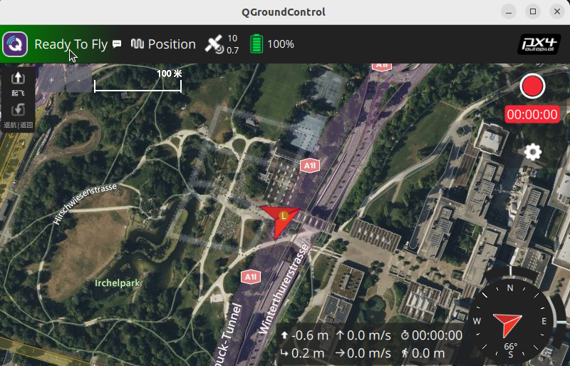
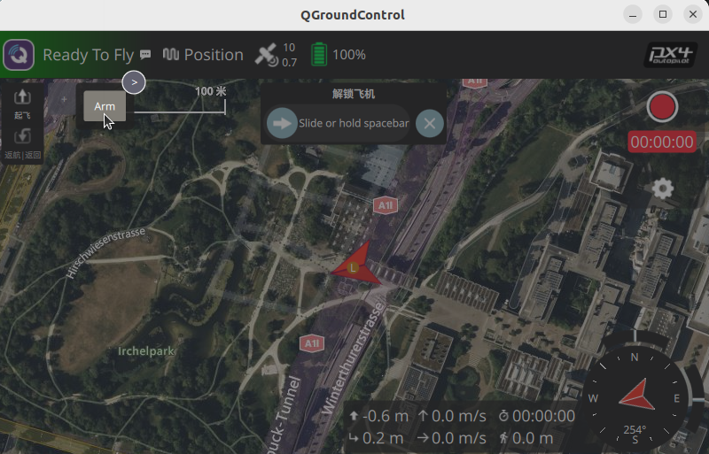
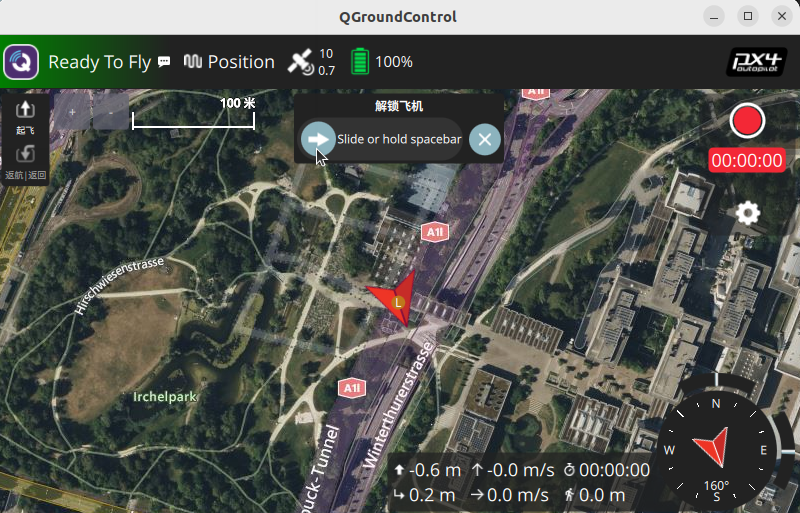
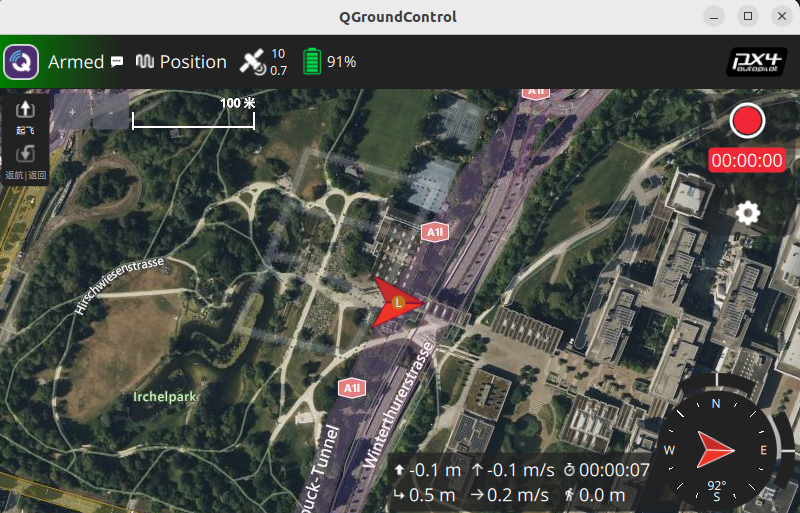

# Teleaqua 仿真环境搭建指南

本文档用于在新电脑上复现当前 **TeleH4Z / TeleaquaH8** 仿真环境。目标效果：

- Docker image 提供 PX4、Gazebo Harmonic、ROS 2 Humble 和已编译 PX4 环境。
- `teleaqua-resources/` 挂载到容器内 `/home/user/external`。
- 仓库根目录 ROS 2 workspace 挂载到容器内 `/home/user/ros2_ws`。
- 容器内重新编译 Gazebo 插件和 ROS 2 控制包。

> [!TIP]
> 已完成环境初始化后，日常启动优先使用第 6 节的一键脚本。手动启动流程主要用于排查问题或理解各模块链路。

## 1. 宿主机安装基础工具

确认 Docker 可用：

```bash
docker version
docker ps
```

登录 Docker Hub，用于拉取私有镜像：

```bash
docker login
```

## 2. 拉取仿真工作区仓库

以下命令在宿主机执行：

```bash
cd "$HOME"
git clone --branch clj --single-branch https://github.com/TeleLoong/TeleaquaH4Z_ros_ws.git
cd "$HOME/TeleaquaH4Z_ros_ws"
```

当前仓库同时包含：

```text
TeleaquaH4Z_ros_ws/
├── src/                  # ROS 2 workspace packages
└── teleaqua-resources/   # Gazebo / PX4 仿真资源
```

当前组合仓库中的 `teleaqua-resources/` 是普通子目录，仿真资源和插件源码已经随仓库一起保存，不需要在该目录下单独执行 `git submodule update`。

> [!IMPORTANT]
> `$HOME/TeleaquaH4Z_ros_ws` 是本机运行和开发目录。根目录作为 ROS 2 workspace 挂载到容器内 `/home/user/ros2_ws`；其中的 `teleaqua-resources/` 挂载到容器内 `/home/user/external`。

## 3. 拉取 Docker 镜像

以下命令在宿主机执行：

```bash
docker pull l1j11n/teleh4z-gazebo:2026-07-13
```

## 4. 启动容器并挂载仓库

首次创建容器：

```bash
xhost +local:docker

docker run -it --name teleh4z-sim \
  --network host \
  --privileged \
  --gpus all \
  -e DISPLAY="$DISPLAY" \
  -e NVIDIA_VISIBLE_DEVICES=all \
  -e NVIDIA_DRIVER_CAPABILITIES=all \
  -e QT_X11_NO_MITSHM=1 \
  -e PX4_ROOT=/home/user/PX4-Autopilot \
  -v /tmp/.X11-unix:/tmp/.X11-unix:ro \
  -v "$HOME/TeleaquaH4Z_ros_ws/teleaqua-resources:/home/user/external" \
  -v "$HOME/TeleaquaH4Z_ros_ws:/home/user/ros2_ws" \
  l1j11n/teleh4z-gazebo:2026-07-13 \
  bash
```

容器已创建后，重新进入：

```bash
docker start -ai teleh4z-sim
```

需要打开更多终端时，在宿主机执行：

```bash
docker exec -it teleh4z-sim bash
```

## 5. 容器内初始化

以下命令在容器内执行。

### 5.1 编译 Gazebo 插件

```bash
cd /home/user/external/plugins
./build_plugin.sh
```

`build_plugin.sh` 主要编译 `bidir_motor_model` 和 `hydrodynamics`。如需手动编译其它插件：

```bash
cd /home/user/external/plugins/buoyancy
rm -rf build && mkdir build && cd build
cmake .. && make -j"$(nproc)"

cd /home/user/external/plugins/hydrodynamics_offical
rm -rf build && mkdir build && cd build
cmake .. && make -j"$(nproc)"
```

> [!WARNING]
> `hydrodynamics_offical/CMakeLists.txt` 可能不完整。如果 cmake 报 `Unknown CMake command "gz_add_system"` 或缺少 `project()`，参考 `plugins/bidir_motor_model/CMakeLists.txt` 补全 `find_package()` 和 `target_link_libraries()`。

### 5.2 同步资源到 PX4

```bash
/home/user/sync_external_into_px4.sh
```

### 5.3 构建 ROS 2 workspace

```bash
cd /home/user/ros2_ws
rm -rf build install log
source /opt/ros/humble/setup.bash
colcon build --symlink-install
source install/setup.bash
```

## 6. 启动仿真（完整流程）

本节的一键启动命令在 **宿主机** 执行，进入的是本机仓库中的 `teleaqua-resources/` 目录。脚本会自动检查并启动 `teleh4z-sim` 容器，再通过 Docker 在容器内启动 Gazebo、PX4 和 ROS 2 相关进程，因此不需要先手动进入容器。

### 6.1 推荐：一键启动 TeleH4Z

宿主机进入本机资源仓库后执行：

```bash
cd "$HOME/TeleaquaH4Z_ros_ws/teleaqua-resources"
./scripts/start_sim.sh
```

脚本会自动完成：

- 检查并启动 `teleh4z-sim` 容器。
- 进入容器内执行仿真启动命令。
- 编译容器内 `/home/user/external/plugins` 并同步资源到 PX4。
- 启动 Micro XRCE-DDS Agent。
- 启动 Gazebo Harmonic `playground` 世界。
- 启动 PX4 SITL TeleH4Z airframe `4026`。
- 启动或提示 ROS 2 模式管理相关流程。

调试 ROS 2 节点时，可跳过插件编译：

```bash
cd "$HOME/TeleaquaH4Z_ros_ws/teleaqua-resources"
SKIP_PLUGIN_BUILD=1 ./scripts/start_sim.sh
```

### 6.2 推荐：一键启动 TeleH4Z + QGC 手柄

宿主机进入本机资源仓库后执行：

```bash
cd "$HOME/TeleaquaH4Z_ros_ws/teleaqua-resources"
./scripts/start_sim_gamepad.sh
```

脚本会启动 Gazebo、PX4、ROS 2 手柄控制节点，并尝试在宿主机打开 QGroundControl。QGC 路径可覆盖：

```bash
cd "$HOME/TeleaquaH4Z_ros_ws/teleaqua-resources"
QGC_APPIMAGE=/path/to/QGroundControl-x86_64.AppImage ./scripts/start_sim_gamepad.sh
```

### 6.3 手动启动：准备 4 个容器终端

手动排查时，打开 4 个宿主机终端，每个终端执行：

```bash
docker exec -it teleh4z-sim bash
```

终端分配：

```text
终端 1: Micro XRCE-DDS Agent
终端 2: Gazebo Harmonic
终端 3: PX4 SITL
终端 4: ROS 2 模式管理器
```

### 6.4 终端 1：启动 Micro XRCE-DDS Agent

```bash
MicroXRCEAgent udp4 -p 8888 > /dev/null 2>&1 &
ss -tuln | grep 8888
```

### 6.5 终端 2：启动 Gazebo

```bash
python3 "$PX4_ROOT/Tools/simulation/gz/simulation-gazebo" \
  --model_store "$PX4_ROOT/Tools/simulation/gz" \
  --world playground \
  --render_engine ogre2 &
```

等待 10-20 秒，Gazebo GUI 应显示水池场景。

验证 GPU 渲染：

```bash
docker exec teleh4z-sim glxinfo -B | grep renderer
```

如果显示 `llvmpipe` 或 `MESA`，说明容器未正确使用 NVIDIA GPU。

### 6.6 终端 3：启动 PX4 SITL（TeleH4Z）

```bash
cd "$PX4_ROOT"
PX4_GZ_STANDALONE=1 \
PX4_SYS_AUTOSTART=4026 \
PX4_SIM_MODEL=teleh4z \
PX4_GZ_MODEL_POSE="0,0,0.2,0,0,0" \
./build/px4_sitl_default/bin/px4 \
  -d "./build/px4_sitl_default/etc" \
  -s "etc/init.d-posix/rcS" \
  -i 0
```

成功标志：Gazebo 中出现 TeleH4Z 模型，PX4 终端输出 `Startup script returned successfully`。

### 6.7 终端 4：启动 ROS 2 模式管理器

```bash
cd /home/user/ros2_ws
source /opt/ros/humble/setup.bash
source install/setup.bash
ros2 launch teleh4z_manager mode_manager.launch.py
```

`mode_manager.launch.py` 默认启动：

- `teleh4z_mode_manager`：协调 PX4 空/水模式和机臂展开/收回。
- `teleh4z_joystick_mapper`：将 QGC 手柄按钮转换成 `air` / `water` 模式请求。
- `teleh4z_manual_water_thruster_mapper`：把 QGC 摇杆量转换成水推 PWM。
- `teleh4z_water_thruster_commander`：发布 Gazebo 水推插件输入。
- `teleh4z_water_thruster_0_bridge` 到 `teleh4z_water_thruster_3_bridge`：桥接 ROS 2 与 Gazebo topic。

### 6.8 模式切换测试

```bash
cd /home/user/ros2_ws
source /opt/ros/humble/setup.bash
source install/setup.bash

ros2 topic pub --once /teleh4z/mode_request std_msgs/msg/String "{data: 'air'}"
ros2 topic pub --once /teleh4z/mode_request std_msgs/msg/String "{data: 'water'}"
ros2 topic echo /fmu/out/vehicle_air_water_status
```

其中 `uw_transit_mode: 0` 表示空中模式，`uw_transit_mode: 1` 表示水中模式，`transform_status: 0` 表示变形完成。

## 7. QGroundControl 手柄控制完整流程

QGroundControl 建议在宿主机运行。容器使用 `--network host` 后，QGC 可以直接连接容器里的 PX4。

### 7.1 启动 QGC

宿主机执行：

```bash
cd "$HOME/QGroundControlQGroundControl"
QT_QPA_PLATFORM=xcb ./QGroundControl-x86_64.AppImage
```

如果提示串口权限或 FUSE 依赖问题：

```bash
sudo usermod -a -G dialout "$USER"
sudo apt-get install -y libfuse2
```

执行后需要注销并重新登录，或重启电脑。

### 7.2 启用手柄

QGC 连接成功后，左上角应从 `Disconnected` 变为已连接状态。然后：

1. 打开 `Application Settings`。
2. 进入 `Joystick` 页面。
3. 选择手柄设备并完成校准。
4. 确认摇杆和按钮在 QGC 页面中有响应。

容器内验证 PX4 收到手柄输入：

```bash
source /opt/ros/humble/setup.bash
source /home/user/ros2_ws/install/setup.bash
ros2 topic echo /fmu/out/manual_control_setpoint
```

### 7.3 默认按钮映射

```text
buttons bit 3（按钮`Y`） -> 空中模式 air，机臂展开，空中旋翼由 PX4 控制
buttons bit 0（按钮`A`） -> 水中模式 water，机臂收回，水下推进器由仿真旁路控制
buttons bit 1 -> 水下推进器回中位，发布 [1500, 1500, 1500, 1500]
```

如果按钮编号和你的手柄不一致：

```bash
ros2 launch teleh4z_manager mode_manager.launch.py \
  joystick_air_button_bit:=3 \
  joystick_water_button_bit:=0 \
  joystick_neutral_button_bit:=1
```

### 7.4 手柄控制步骤

1. 启动仿真并等待 Gazebo 中 TeleH4Z 正常漂浮。
2. 启动 QGC，确认连接 PX4。
3. 在 QGC 中点击 `Arm` 解锁。

QGC 解锁操作参考：



图 1：QGC 已连接 PX4，点击左上角`Ready To Fly`区域。



图 2：选择 `Arm` 进入解锁确认。



图 3：按提示滑动按钮或按住空格键，确认执行解锁。



图 4：左上角显示 `Armed`，表示 PX4 已完成解锁。

4. 按 `air` 按钮（按钮`Y`）切到空中模式，确认机臂展开；推动摇杆，空中旋翼应响应。
5. 按 `water` 按钮（按钮`A`）切到水中模式，确认机臂收回；推动摇杆，水下推进器应响应。

水下旁路控制链路：

```text
QGC 手柄
  -> PX4 MAVLink manual control
  -> /fmu/out/manual_control_setpoint
  -> teleh4z_manual_water_thruster_mapper
  -> /teleh4z/water_thruster_pwm
  -> teleh4z_water_thruster_commander
  -> /teleh4z_manual/servo_0..3
  -> Gazebo BiDirectionalMotorModel
```

水下控制默认 PWM：

```text
/teleh4z/water_thruster_pwm 顺序: [right, front, left, back]
中位: 1500
范围: 1000 到 2000
water_thruster_surge_pwm_scale: -280.0
```

常用验证命令：

```bash
ros2 topic echo /fmu/out/vehicle_air_water_status
ros2 topic echo /fmu/out/manual_control_setpoint
ros2 topic echo /teleh4z/water_thruster_pwm
ros2 topic echo /teleh4z_manual/servo_0
gz topic -i -t /teleh4z_manual/servo_0
gz topic -e -t /teleh4z_manual/servo_0
```

临时关闭水下手柄旁路：

```bash
ros2 launch teleh4z_manager mode_manager.launch.py enable_water_thruster_joystick:=false
```

## 8. 启动 TeleaquaH8

当前 H8 推荐使用带单目相机的模型：

```text
teleaquah8p_mono_cam
```

其中 `teleaquah8p_mono_cam` 会通过 `model://teleaquah8p` 引入 H8 本体模型。

容器内另开终端执行：

```bash
cd /home/user/PX4-Autopilot
PX4_GZ_STANDALONE=1 \
PX4_SYS_AUTOSTART=4024 \
PX4_SIM_MODEL=teleaquah8p_mono_cam \
PX4_GZ_MODEL_POSE="0,0,0.5,0,0,0" \
./build/px4_sitl_default/bin/px4 \
  -d "./build/px4_sitl_default/etc" \
  -s "etc/init.d-posix/rcS" \
  -i 0
```

参数说明：

- `PX4_SYS_AUTOSTART=4024`：加载 TeleaquaH8 airframe。
- `PX4_SIM_MODEL=teleaquah8p_mono_cam`：生成带单目相机的 H8P Gazebo 模型。
- `PX4_GZ_MODEL_POSE`：设置模型出生位置。
- `PX4_GZ_STANDALONE=1`：表示 Gazebo 已经单独启动，PX4 只连接并生成模型。

H8 启动后检查：

```bash
source /opt/ros/humble/setup.bash
source /home/user/ros2_ws/install/setup.bash

ros2 topic list
ros2 topic echo /fmu/out/vehicle_status
ros2 topic echo /fmu/out/manual_control_setpoint
```

## 9. 常用检查命令

以下命令在容器内执行：

```bash
source /opt/ros/humble/setup.bash
source /home/user/ros2_ws/install/setup.bash

ros2 topic list
ros2 topic echo /fmu/out/vehicle_status
ros2 topic echo /fmu/out/manual_control_setpoint
ros2 topic echo /fmu/out/vehicle_air_water_status
```

检查关键进程：

```bash
ps -eo pid,cmd | grep -E "MicroXRCEAgent|px4|gz sim|simulation-gazebo" | grep -v grep
```

## 10. 检查插件调用是否正确

本项目常用插件：

```text
/home/user/external/plugins/bidir_motor_model/build/libgz-sim-bidir-motor-model-system.so
/home/user/external/plugins/buoyancy/build/libbuoyancy.so
/home/user/external/plugins/hydrodynamics/build/libhydrodynamics.so
/home/user/external/plugins/hydrodynamics_offical/build/libhydrodynamics.so
```

Gazebo 会从 `GZ_SIM_SYSTEM_PLUGIN_PATH` 搜索 SDF 中声明的插件。建议按需设置：

```bash
export GZ_SIM_SYSTEM_PLUGIN_PATH=/home/user/external/plugins/bidir_motor_model/build:\
/home/user/external/plugins/buoyancy/build:\
/home/user/external/plugins/hydrodynamics/build
```

> [!CAUTION]
> `hydrodynamics` 和 `hydrodynamics_offical` 都会生成 `libhydrodynamics.so`，不要同时放入 `GZ_SIM_SYSTEM_PLUGIN_PATH`，避免同名插件冲突。如果 submodule 版 `hydrodynamics` 缺失，优先临时使用 `hydrodynamics_offical`。

## 11. 常见问题

### Gazebo GUI 打不开

宿主机执行：

```bash
xhost +local:docker
```

然后重新启动容器或重新运行启动脚本。

### Gazebo 界面非常卡

通常是容器启动时缺少 `--gpus all`，Gazebo 正在使用 CPU 渲染。检查 `docker run` 命令是否包含 `--gpus all`。

容器内验证：

```bash
nvidia-smi
glxinfo -B | grep renderer
```

### 根分区空间不足

镜像压缩后约 8.5 GB，解压需要更多空间。如果根分区较小，需要提前迁移 Docker 数据到 `/home`。

宿主机参考执行：

```bash
sudo bash <path-to>/scripts/migrate_docker_to_home.sh
sudo bash <path-to>/scripts/migrate_containerd_to_home.sh
```

### Docker 拉取网络超时

直接重试即可，Docker 会复用已下载层：

```bash
docker pull l1j11n/teleh4z-gazebo:2026-07-13
```

### Docker 容器名已存在

确认旧容器不需要保留后：

```bash
docker rm teleh4z-sim
```

然后重新执行第 4 节的 `docker run`。

### 手柄按钮能切模式，但水下推进器不动

先确认 PX4 和 XRCE-DDS 仍在运行：

```bash
ps -eo pid,cmd | grep -E "MicroXRCEAgent|px4" | grep -v grep
ros2 topic info /fmu/out/manual_control_setpoint
ros2 topic info /fmu/out/vehicle_air_water_status
```

确认水下旁路节点已启动：

```bash
ros2 node list | grep -E "manual_water|water_thruster|joystick_mapper"
```

应至少看到：

```text
/teleh4z_joystick_mapper
/teleh4z_manual_water_thruster_mapper
/teleh4z_water_thruster_commander
/teleh4z_water_thruster_0_bridge
/teleh4z_water_thruster_1_bridge
/teleh4z_water_thruster_2_bridge
/teleh4z_water_thruster_3_bridge
```

确认推摇杆时 PWM 变化：

```bash
ros2 topic echo /teleh4z/water_thruster_pwm
gz topic -i -t /teleh4z_manual/servo_0
gz topic -e -t /teleh4z_manual/servo_0
```

### 水下模式前进/后退方向反了

默认通过 `water_thruster_surge_pwm_scale:=-280.0` 修正。可临时改符号：

```bash
ros2 launch teleh4z_manager mode_manager.launch.py water_thruster_surge_pwm_scale:=280.0
```

其它水下手柄参数也可覆盖：

```bash
ros2 launch teleh4z_manager mode_manager.launch.py \
  water_thruster_surge_pwm_scale:=-280.0 \
  water_thruster_yaw_pwm_scale:=180.0 \
  water_thruster_heave_pwm_scale:=260.0 \
  water_thruster_pitch_pwm_scale:=160.0
```

### QGC 能连接，但 ROS 2 收不到 manual_control_setpoint

检查 QGC Joystick 页面是否启用了手柄并完成校准：

```bash
ros2 topic echo /fmu/out/manual_control_setpoint
```

如果 topic 存在但没有数据，确认 PX4 和 Micro XRCE-DDS Agent 仍在运行，并重新连接 QGC。

### ROS 2 找不到 teleh4z_manager

容器内执行：

```bash
cd /home/user/ros2_ws
source /opt/ros/humble/setup.bash
colcon build --symlink-install
source install/setup.bash
ros2 pkg list | grep teleh4z_manager
```

### PX4 找不到 4026 airframe

容器内执行：

```bash
ls /home/user/PX4-Autopilot/ROMFS/px4fmu_common/init.d-posix/airframes/4026_gz_teleh4z
ls /home/user/PX4-Autopilot/build/px4_sitl_default/etc/init.d-posix/airframes/4026_gz_teleh4z
```

如果文件不存在，重新同步资源：

```bash
/home/user/sync_external_into_px4.sh
```
